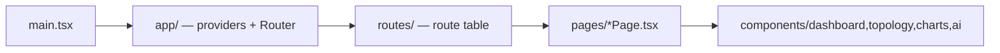
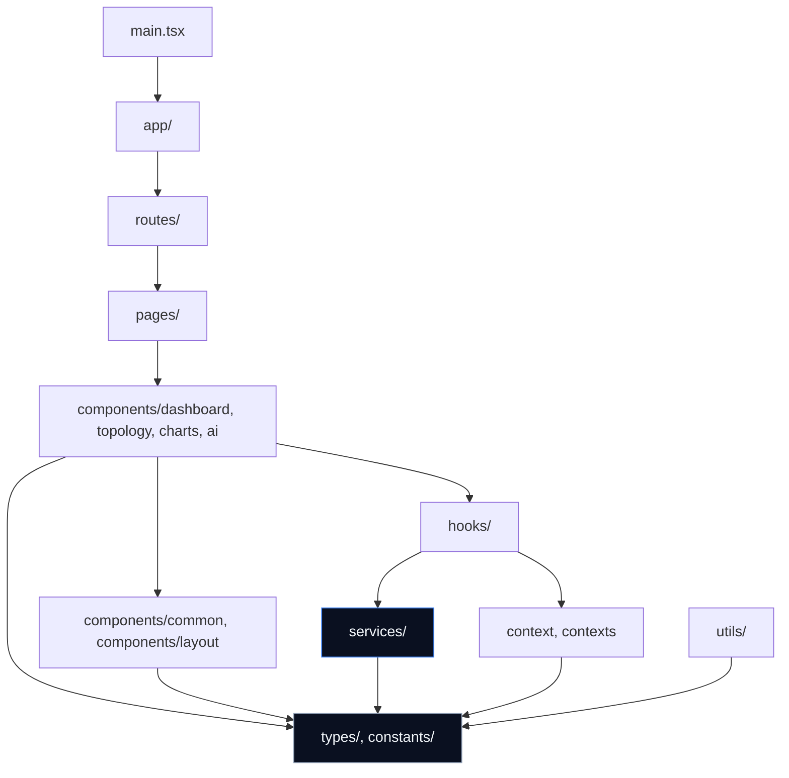
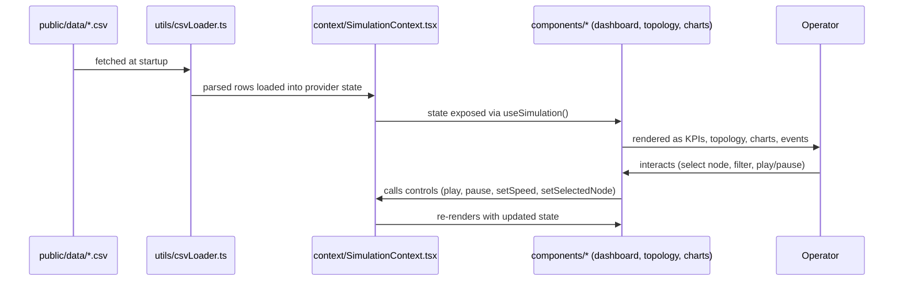

# App Structure

> How the HELIOS React application is organized, why it's organized that way, and how information flows through it. This document is the ground truth for "where does this code go." Naming rules for files within these folders live in [FRONTEND_GUIDELINES.md § 8](./FRONTEND_GUIDELINES.md#8-naming-conventions); visual styling rules live in [DESIGN_SYSTEM.md](./DESIGN_SYSTEM.md).

## Table of Contents

1. [Complete Folder Structure](#1-complete-folder-structure)
2. [Purpose of Every Folder](#2-purpose-of-every-folder)
3. [Purpose of Major Root Files](#3-purpose-of-major-root-files)
4. [Component Organization](#4-component-organization)
5. [Services](#5-services)
6. [Hooks](#6-hooks)
7. [Contexts](#7-contexts)
8. [Assets](#8-assets)
9. [Utilities](#9-utilities)
10. [Constants](#10-constants)
11. [Types](#11-types)
12. [Routing Organization](#12-routing-organization)
13. [Styling Organization](#13-styling-organization)
14. [Public Assets](#14-public-assets)
15. [Reusability Strategy](#15-reusability-strategy)
16. [Dependency Direction](#dependency-direction)
17. [Import Rules & Module Boundaries](#17-import-rules--module-boundaries)
18. [Information Flow Through the Application](#18-information-flow-through-the-application)
19. [Future Scalability](#19-future-scalability)
20. [Lazy Loading Strategy](#lazy-loading-strategy)
21. [Code Splitting Strategy](#21-code-splitting-strategy)

---

## 1. Complete Folder Structure

This reflects the current repository state: files that exist today, plus folders that have been scaffolded ahead of use (currently empty, marked `(scaffolded)`) for the architecture described in this document.

```
frontend/
├── index.html
├── package.json
├── vite.config.ts
├── tsconfig.json
├── tsconfig.app.json
├── tsconfig.node.json
├── public/
│   ├── data/                      # Synthetic dataset CSVs served as static assets
│   └── icons.svg                  # Shared SVG icon sprite
└── src/
    ├── main.tsx                   # Application entry point
    ├── App.tsx                    # Root component, current dashboard shell
    ├── index.css                  # Global styles, design tokens, keyframes
    │
    ├── app/                       (scaffolded) App-level composition: providers, router mount
    ├── assets/                    Static imported assets (images, etc.)
    │   ├── hero.png
    │   └── vite.svg
    │
    ├── components/                 UI components, organized feature-first
    │   ├── ai/                    (scaffolded) AI reasoning / explainability UI
    │   ├── charts/                (scaffolded) Chart components (Recharts-based)
    │   ├── common/                (scaffolded) Shared, feature-agnostic UI primitives
    │   ├── dashboard/             (scaffolded) Dashboard-specific panels (KPIs, gauges, alerts)
    │   ├── layout/                (scaffolded) App shell / structural layout components
    │   ├── topology/              (scaffolded) Network topology visualization (Cytoscape.js)
    │   │
    │   ├── ChartsPanel.tsx         Existing — target: components/charts/
    │   ├── EdgeServerPanel.tsx     Existing — target: components/dashboard/
    │   ├── EventLog.tsx            Existing — target: components/dashboard/
    │   ├── FailureAlerts.tsx       Existing — target: components/dashboard/
    │   ├── FilterPanel.tsx         Existing — target: components/dashboard/
    │   ├── Header.tsx              Existing — target: components/layout/
    │   ├── HealthGauge.tsx         Existing — target: components/dashboard/
    │   ├── KPIPanel.tsx            Existing — target: components/dashboard/
    │   ├── NetworkTopology.tsx     Existing — target: components/topology/
    │   ├── NodeDetailPanel.tsx     Existing — target: components/dashboard/
    │   ├── ParticleBackground.tsx  Existing — target: components/layout/
    │   ├── SearchBar.tsx           Existing — target: components/common/
    │   └── SimulationControls.tsx  Existing — target: components/dashboard/
    │
    ├── constants/                  (scaffolded) App-wide constant values
    ├── context/                    Existing context implementation
    │   └── SimulationContext.tsx   Simulation state provider + useSimulation hook
    ├── contexts/                   (scaffolded) Target location — see § 7 for migration note
    ├── hooks/                      (scaffolded) Shared custom hooks
    ├── pages/                      (scaffolded) Route-level page components
    ├── routes/                     (scaffolded) Route definitions
    ├── services/                   (scaffolded) Axios API layer
    ├── styles/                     (scaffolded) Additional global/shared stylesheets
    ├── types/                      Shared TypeScript types
    │   └── index.ts                Data row types, simulation/UI state types
    └── utils/                      Shared utility functions
        └── csvLoader.ts            CSV dataset loading utility
```

## 2. Purpose of Every Folder

| Folder | Purpose |
|---|---|
| `public/` | Files served as-is, unprocessed by Vite's build pipeline. Referenced by absolute path (e.g. `/icons.svg`). Holds the synthetic dataset CSVs (`public/data/`) consumed by `utils/csvLoader.ts` and the shared icon sprite. |
| `src/app/` | App-level composition root: where global providers (Context, future Router, future theming) are wired together, separate from `main.tsx`'s minimal bootstrap and `App.tsx`'s current dashboard-specific shell. See [§ 12](#12-routing-organization) for how this folder absorbs router setup. |
| `src/assets/` | Static assets imported directly into components (images, local SVGs) that need to go through Vite's asset pipeline (hashing, optimization) — as opposed to `public/`, which bypasses it. |
| `src/components/` | All UI components, organized feature-first (see [§ 4](#4-component-organization)). |
| `src/constants/` | Named constant values shared across features — thresholds, magic numbers promoted to named exports, fixed configuration values (e.g. `MAX_HISTORY`, `TOTAL_TICKS`, currently inline in `SimulationContext.tsx`, are natural candidates once reused elsewhere). |
| `src/context/` / `src/contexts/` | React Context providers and their consumer hooks. See [§ 7](#7-contexts) for the naming/migration note between these two currently-coexisting folders. |
| `src/hooks/` | Custom hooks shared across more than one feature. Feature-specific hooks may instead be colocated with their feature (see [FRONTEND_GUIDELINES.md § 11](./FRONTEND_GUIDELINES.md#11-hook-guidelines)). |
| `src/pages/` | Top-level route components — the components mounted directly by the router. A page composes feature components; it does not itself contain complex rendering logic. |
| `src/routes/` | Route configuration: path-to-page mapping, route guards, nested route trees. See [§ 12](#12-routing-organization) and [ROUTES.md](./ROUTES.md). |
| `src/services/` | Axios-based API access layer. One module per backend domain/resource. Framework-agnostic — no React imports. See [§ 5](#5-services). |
| `src/styles/` | Global or cross-cutting stylesheets beyond `index.css` (e.g. a future `tokens.css`, `animations.css` split), and any non-component CSS. See [§ 13](#13-styling-organization). |
| `src/types/` | Shared TypeScript types and interfaces used across more than one feature. Feature-local types may instead live next to their feature. |
| `src/utils/` | Small, pure, framework-agnostic helper functions (e.g. `csvLoader.ts`) with no component or hook dependencies. |

## 3. Purpose of Major Root Files

| File | Purpose |
|---|---|
| `main.tsx` | The actual application entry point — mounts the root React tree into `#root`. Kept minimal: import global CSS, render `<App />` (or, once routing lands, the composition root in `app/`). |
| `App.tsx` | Currently the dashboard shell itself: wraps the tree in `SimulationProvider` and renders the full grid layout described in [DASHBOARD_LAYOUT.md](./DASHBOARD_LAYOUT.md). As routing is introduced (see [§ 12](#12-routing-organization)), `App.tsx`'s responsibility narrows to top-level provider composition, and today's dashboard JSX moves into `pages/DashboardPage.tsx`. |
| `index.css` | Global stylesheet: Tailwind entry (`@import "tailwindcss";`), all design token custom properties (see [DESIGN_SYSTEM.md § 3](./DESIGN_SYSTEM.md#color-system)), global resets, keyframe animations, and named utility classes (`.glass-card`, `.kpi-card`, etc.). |
| `vite.config.ts` | Build tool configuration — React plugin, Tailwind Vite plugin. Tailwind v4's CSS-first configuration means there is no separate `tailwind.config.js` (see [DESIGN_SYSTEM.md § 25](./DESIGN_SYSTEM.md#25-dark-theme-rules) context and [FRONTEND_GUIDELINES.md § 15](./FRONTEND_GUIDELINES.md#15-styling-rules--tailwind-conventions)). |
| `tsconfig*.json` | TypeScript project configuration, split into app/node configs per Vite's standard scaffold. |

## 4. Component Organization

### 4.1 Feature-First Grouping

Components are grouped by **product feature**, not technical type (see [FRONTEND_GUIDELINES.md § 7](./FRONTEND_GUIDELINES.md#7-feature-first-organization)):

| Subfolder | Contains |
|---|---|
| `components/dashboard/` | KPI tiles, health gauge, event log, alerts, node detail panel, edge server panel, simulation controls, filter panel — the core operational-dashboard panels |
| `components/topology/` | Cytoscape.js-based network graph rendering and its direct sub-components |
| `components/charts/` | Recharts-based chart components (time series, gauges-as-charts, distributions) |
| `components/ai/` | Explainable-AI / reasoning presentation components (e.g. rendering the AI's decision explanations described in `PROJECT_STATE.md`'s Explainable AI module) — presentation only; no AI logic lives in the frontend |
| `components/layout/` | Structural shell components: header, particle background, future footer/sidebar |
| `components/common/` | Feature-agnostic, reusable primitives: buttons, badges, search input, tooltips — usable by any feature without knowing about it |

### 4.2 Shared vs. Feature Components

The test for whether a component belongs in `common/` vs. a feature folder: **would this component make sense in a completely different HELIOS feature with zero modification?** A `SearchBar` — yes, `common/`. A `HealthGauge` sized and styled specifically for network health scoring — no, `dashboard/`, even if visually it's "just a gauge," because its data shape and meaning are dashboard-specific.

### 4.3 Current Flat Structure Note

As shown in [§ 1](#1-complete-folder-structure), today's components live as a flat list directly in `components/`. The subfolders above are scaffolded and ready; migrating each existing component into its target subfolder (annotated in the tree) is tracked as frontend work in [UI_TASKS.md](./UI_TASKS.md) rather than performed as a side effect of writing this document (see [FRONTEND_GUIDELINES.md](./FRONTEND_GUIDELINES.md) — do not restructure unrelated code opportunistically).

## 5. Services

`src/services/` holds the Axios-based data-access layer that will connect the frontend to backend APIs, per [API_CONTRACTS.md](./API_CONTRACTS.md). Structure:

- One service module per backend resource/domain (e.g. `topologyService.ts`, `predictionService.ts`) — never one giant `api.ts` file handling every resource.
- A shared, pre-configured Axios instance (base URL, interceptors for error normalization) is created once and imported by each service module — services do not each instantiate their own Axios client.
- Services expose typed functions (`getX(): Promise<X>`), never raw Axios response objects — the response shape is unwrapped and typed at the service boundary so components never touch `AxiosResponse` directly.
- **No concrete endpoints, request/response shapes, or base-URL/environment-variable values are defined here** — those are owned exclusively by [API_CONTRACTS.md](./API_CONTRACTS.md) and must not be invented in frontend code ahead of that contract being defined, per the root [`CLAUDE.md`](../../CLAUDE.md) rule against inventing APIs or environment variables.
- Services must never import React, hooks, or components (see [FRONTEND_GUIDELINES.md § 5](./FRONTEND_GUIDELINES.md#5-clean-architecture-in-helios)).

## 6. Hooks

`src/hooks/` holds custom hooks used by more than one feature. Candidates for promotion into this folder include cross-cutting concerns like a future `useMediaQuery`, `useDebouncedValue`, or a `useApi`-style data-fetching wrapper around the `services/` layer. Feature-specific hooks (e.g. a hook only `topology/` components use) are colocated with that feature instead, per [FRONTEND_GUIDELINES.md § 11](./FRONTEND_GUIDELINES.md#11-hook-guidelines) — `hooks/` is not a dumping ground for every hook in the app.

## 7. Contexts

Two folders currently coexist: `src/context/` (existing, singular, holding `SimulationContext.tsx`) and `src/contexts/` (scaffolded, plural, empty). This is a known, intentional-but-temporary duplication surfaced by the scaffolding pass — **new context work should not silently pick one**; the project should standardize on a single naming convention (recommendation: consolidate onto `contexts/`, plural, matching the pluralized convention used by `hooks/`, `services/`, `pages/`) as a deliberate, tracked cleanup rather than an incidental change. Until that consolidation happens, `SimulationContext.tsx` remains in `context/` as-is — see [FRONTEND_GUIDELINES.md § 25](./FRONTEND_GUIDELINES.md#25-things-developers-should-never-do) (never rename/move existing code as a side effect of unrelated work).

Each context module follows the pattern established by `SimulationContext.tsx` — see [FRONTEND_GUIDELINES.md § 12](./FRONTEND_GUIDELINES.md#12-context-usage) for the full rule set (typed value interface, `Provider` + `useX()` hook, throw-if-outside-provider).

## 8. Assets

`src/assets/` holds imported binary/vector assets that benefit from Vite's asset pipeline (content-hashed filenames for cache-busting, image optimization). Use this folder — rather than `public/` — for any image or icon that is imported directly into a component (`import hero from '../assets/hero.png'`). Reserve `public/` (see [§ 14](#14-public-assets)) for assets referenced by static URL instead.

## 9. Utilities

`src/utils/` holds small, pure, framework-agnostic functions with no React dependency — e.g. `csvLoader.ts`, which parses the synthetic dataset CSVs into typed row arrays for `SimulationContext`. A function belongs here if it could be unit-tested with no React renderer at all. If a "utility" starts depending on React state or hooks, it isn't a util anymore — it's a hook (see [§ 6](#6-hooks)).

## 10. Constants

`src/constants/` holds named constant values shared across more than one file — magic numbers, fixed thresholds, enumerated option lists. Values used in only one file (e.g. `MAX_HISTORY` and `TOTAL_TICKS`, currently local to `SimulationContext.tsx`) are not required to move here preemptively; promote a constant to this folder when a second consumer needs it, to avoid a speculative, empty-feeling folder full of one-off values.

## 11. Types

`src/types/index.ts` is the shared type barrel: dataset row shapes (`TowerUtilizationRow`, `TrafficProfileRow`, `TowerFailureRow`, `EdgeServerRow`, `NetworkHealthRow`, `NetworkNodeRow`), simulation state/control types, event types, and UI state types (`SelectedNode`, `FilterState`). Types used by only one feature may instead be declared alongside that feature's component/hook file — promotion to the shared barrel happens on second use, mirroring the rule in [§ 10](#10-constants).

## 12. Routing Organization

React Router (finalized stack dependency) is not yet wired in — the application is currently a single implicit "route" (the dashboard). The scaffolded structure anticipates its introduction as follows:



- `src/routes/` defines the route table (path → page component mapping), and any route guards (e.g. gating a future settings/auth-adjacent route).
- `src/pages/` holds one component per route (e.g. `DashboardPage.tsx`), composing feature components rather than containing dense logic itself.
- `src/app/` is where `<BrowserRouter>` (or equivalent) and global providers are composed together, keeping `main.tsx` a minimal bootstrap file.
- Full route map and navigation structure — once routes exist — is documented in [ROUTES.md](./ROUTES.md), not here; this section only defines *where the routing code lives*.

## 13. Styling Organization

- **`index.css`** remains the single source for design tokens (CSS custom properties), global resets, keyframes, and the current set of named utility classes — this is intentional centralization so [DESIGN_SYSTEM.md](./DESIGN_SYSTEM.md) has one file to stay in sync with.
- **`src/styles/`** is reserved for splitting `index.css` further as it grows (e.g. `tokens.css`, `animations.css`, `components.css`) or for styles that are global but not core tokens. This split has not yet been necessary at current file size, per [FRONTEND_GUIDELINES.md](./FRONTEND_GUIDELINES.md)'s instruction not to add structure ahead of need.
- Component-scoped styling is handled via Tailwind utility classes directly in JSX, not via CSS Modules or styled-components — no CSS-in-JS library is part of the finalized stack.

## 14. Public Assets

`public/` is served verbatim by Vite at the site root:

- `public/data/` — the synthetic dataset CSVs (tower utilization, traffic profile, tower failures, edge servers, network health, network nodes) that `utils/csvLoader.ts` fetches at runtime to drive the simulation. These mirror the source datasets in the repository's top-level `datasets/` folder but are the copies actually loaded by the running frontend.
- `public/icons.svg` — a shared SVG sprite referenced by `<use>` for icons not sourced from React Icons.

Assets placed here are **not** processed, hashed, or optimized by Vite — use `public/` only for files that must be fetched by a predictable, stable URL (like the CSV datasets, fetched by path at runtime) rather than imported into a bundle.

## 15. Reusability Strategy

1. **Extract on second use, not preemptively.** A pattern used once stays inline; a pattern used twice moves to `common/`, `hooks/`, `utils/`, `types/`, or `constants/` as appropriate (see [FRONTEND_GUIDELINES.md § 25](./FRONTEND_GUIDELINES.md#25-things-developers-should-never-do) on speculative abstraction).
2. **Reusable ≠ configurable.** A component becomes reusable by being well-scoped and composable (accepting children, accepting focused props), not by accumulating optional props for every conceivable variant.
3. **Feature-agnostic is the bar for `common/`.** See [§ 4.2](#42-shared-vs-feature-components).
4. **Types and constants are reused by import, never by copy-paste.** Duplicated inline type shapes across files are a signal the type belongs in `types/`.

## Dependency Direction

This is the folder-level expression of the architectural rule defined in [FRONTEND_GUIDELINES.md § 5](./FRONTEND_GUIDELINES.md#5-clean-architecture-in-helios):



Reading the graph: an arrow means "may import from." `types/` and `constants/` sit at the bottom of the dependency graph and are imported from everywhere but import from nothing feature-specific. `services/` never imports upward (no hooks, no components). Two sibling feature folders under `components/` (e.g. `topology/` and `charts/`) never import from each other directly — shared needs are hoisted to `common/`, `hooks/`, or `utils/`.

## 17. Import Rules & Module Boundaries

- Imports must follow the direction of the graph in [§ 16](#dependency-direction) — a lower layer must never import from a higher one (enforced in review, per [FRONTEND_GUIDELINES.md § 22](./FRONTEND_GUIDELINES.md#22-code-review-expectations)).
- Cross-feature imports within `components/` (e.g. `dashboard/` importing directly from `topology/`'s internals) are not allowed; if two features need to share something, that something belongs in `common/`, `hooks/`, `types/`, or `constants/`.
- Import ordering within a file follows [FRONTEND_GUIDELINES.md § 9](./FRONTEND_GUIDELINES.md#9-import-ordering).
- No folder in this document is a dumping ground: before adding a file to `common/`, `hooks/`, `utils/`, `constants/`, or `types/`, confirm it meets that folder's stated bar for inclusion (Sections 4.2, 6, 9, 10, 11) rather than defaulting there for convenience.

## 18. Information Flow Through the Application

Concretely, for the current dashboard (before routing lands):



Once `services/` and a real backend connection exist per [API_CONTRACTS.md](./API_CONTRACTS.md), the same shape applies with `services/` (Axios) replacing or supplementing `utils/csvLoader.ts` as a data source feeding into contexts/hooks — the unidirectional flow into panels and back out via controls does not change.

## 19. Future Scalability

The feature-first `components/` structure and the strict dependency direction (§ 16) are chosen specifically so that new HELIOS product areas (e.g. a future Strategy Planner UI, or a dedicated Explainable AI view per `PROJECT_STATE.md`) can be added as new sibling folders under `components/` and `pages/` without touching existing features. Scaling the app is expected to mean:

- New `components/<feature>/` folders as new product surfaces are built (the `ai/` folder is already scaffolded ahead of the Explainable AI module reaching the frontend).
- New `pages/` + `routes/` entries per [§ 12](#12-routing-organization), rather than growing the single dashboard shell indefinitely.
- New `services/` modules per backend domain as [API_CONTRACTS.md](./API_CONTRACTS.md) grows — one module per resource keeps this scalable without a monolithic API client.

## Lazy Loading Strategy

Once `react-router-dom` routes exist (§ 12), each `pages/*Page.tsx` is loaded via `React.lazy()` and rendered behind a `<Suspense>` boundary at the router level, so navigating to a route that hasn't been visited yet doesn't require downloading code for every other route up front. The always-visible dashboard route may reasonably be eagerly loaded (it is effectively the app's home surface today), while secondary/future routes (settings, a dedicated AI reasoning view, etc.) are lazy by default.

Suspense fallbacks reuse the existing loading-state visual language (see [DESIGN_SYSTEM.md § 21](./DESIGN_SYSTEM.md#21-interactive-states) and [FRONTEND_GUIDELINES.md § 19](./FRONTEND_GUIDELINES.md#19-loading-states)) rather than a generic unstyled fallback.

## 21. Code Splitting Strategy

- **Route-based splitting** (§ 20 above) is the primary and default splitting boundary — it aligns naturally with how a user navigates the app and requires no manual bundle analysis to justify.
- **Heavy, rarely-needed libraries** are candidates for dynamic `import()` at the point of use rather than the top of a bundle — Cytoscape.js's topology rendering is a plausible candidate once it is not needed on every route, since graph-rendering libraries are typically large.
- Code splitting is applied where it addresses a real, observed bundle-size concern — it is not applied reflexively to every module. Vite/Rollup's default vendor-chunking behavior is sufficient until a specific route or library is shown to warrant manual splitting.

---

## Related Documents

| Document | Relationship |
|---|---|
| [FRONTEND_GUIDELINES.md](./FRONTEND_GUIDELINES.md) | The engineering rules this structure exists to serve, especially § 5 (Clean Architecture) and § 7 (Feature-First Organization) |
| [DESIGN_SYSTEM.md](./DESIGN_SYSTEM.md) | What lives inside `index.css` / `styles/` |
| [COMPONENT_LIBRARY.md](./COMPONENT_LIBRARY.md) | The inventory of components organized per § 4 |
| [ROUTES.md](./ROUTES.md) | The full route map enabled by § 12 |
| [API_CONTRACTS.md](./API_CONTRACTS.md) | The contracts `services/` (§ 5) will implement against |
