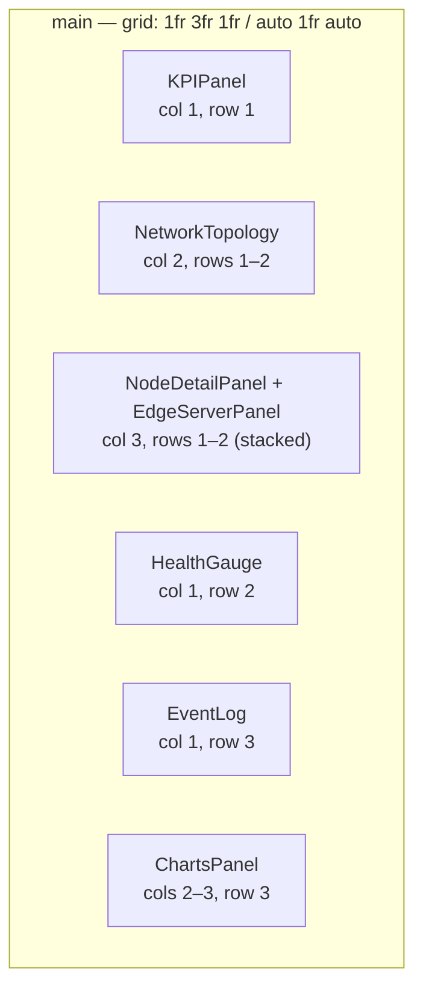

# Dashboard Layout

> How the HELIOS operational dashboard composes its panels into a single, fixed, full-viewport console. This document describes the grid and panel composition as implemented in `App.tsx` today. Visual treatment of the grid's surfaces (glass, glow, radius) lives in [DESIGN_SYSTEM.md](./DESIGN_SYSTEM.md); the components that fill each panel are inventoried in [COMPONENT_LIBRARY.md](./COMPONENT_LIBRARY.md).

## Table of Contents

- [Overview](#overview)
- [Layout Grid](#layout-grid)
- [Panels](#panels)
- [Responsive Behavior](#responsive-behavior)

## Overview

The dashboard is a single, non-scrolling, full-viewport screen (`h-screen w-screen overflow-hidden`) — a NOC-style operational console, not a scrolling page (see [DESIGN_SYSTEM.md § 24](./DESIGN_SYSTEM.md#24-page-layout)). Today, the entire application *is* this one screen: `Dashboard` (defined inline in `App.tsx`) renders a `ParticleBackground`, a persistent `Header`, transient `FailureAlerts`, and a single `<main>` grid holding every operational panel. There is currently no routing (see [ROUTES.md](./ROUTES.md)) — this layout is what every user sees.

While `state.isLoading` is `true` (initial CSV fetch via `utils/csvLoader.ts`, driven by `SimulationContext`), the dashboard grid is not rendered at all — a dedicated `.loading-screen` (ring spinner + "HELIOS" wordmark) is shown in its place. See [FRONTEND_GUIDELINES.md § 19](./FRONTEND_GUIDELINES.md#19-loading-states).

## Layout Grid

`<main>` is a CSS Grid with a fixed 3-column, 3-row template, matching [DESIGN_SYSTEM.md § 7](./DESIGN_SYSTEM.md#7-grid-system--container-widths):

```
gridTemplateColumns: 1fr 3fr 1fr
gridTemplateRows:    auto 1fr auto
gap: 16px (Tailwind gap-4), padding: 16px (Tailwind p-4)
```



Grid cells are placed via explicit `col-span-*` / `row-span-*` utility classes on wrapper `<div>`s in `App.tsx` — there is no CSS Grid area naming (`grid-template-areas`) in use today. `NetworkTopology` and the right-column detail stack (`NodeDetailPanel` + `EdgeServerPanel`) each span both content rows (`row-span-2`), making the topology the visual focal point at 3fr width while KPIs, health, and events share the narrow 1fr left column stacked vertically.

## Panels

| Grid position | Component | Height / span | Notes |
|---|---|---|---|
| Col 1, Row 1 | [`KPIPanel`](./COMPONENT_LIBRARY.md#kpipanel) | `row-span-1` | 3-column grid of 6 KPI tiles (health score, latency, packet loss, bandwidth, power, availability) |
| Col 2, Rows 1–2 | [`NetworkTopology`](./COMPONENT_LIBRARY.md#networktopology) | `row-span-2` | Cytoscape.js graph; the dashboard's visual center |
| Col 3, Rows 1–2 | [`NodeDetailPanel`](./COMPONENT_LIBRARY.md#nodedetailpanel) + [`EdgeServerPanel`](./COMPONENT_LIBRARY.md#edgeserverpanel) | `row-span-2`, stacked via `flex flex-col`, each `h-1/2` | Detail panel shows the currently selected topology node; edge panel is always-on, showing all 4 edge servers |
| Col 1, Row 2 | [`HealthGauge`](./COMPONENT_LIBRARY.md#healthgauge) | `row-span-1`, wrapped directly in `glass-card-static` by `App.tsx` (not the component itself) | Circular SVG gauge, centered via `flex items-center justify-center` |
| Col 1, Row 3 | [`EventLog`](./COMPONENT_LIBRARY.md#eventlog) | `row-span-1`, fixed `h-48` | Scrolling AI-generated event feed, auto-scrolls to newest |
| Cols 2–3, Row 3 | [`ChartsPanel`](./COMPONENT_LIBRARY.md#chartspanel) | `col-span-2`, fixed `h-48` | 4-up chart grid: latency, bandwidth, traffic-by-service, per-tower utilization |

Two elements render outside the grid, above it in stacking order:

- **`Header`** — fixed `h-16` bar above `<main>`, not part of the grid; holds brand mark, `SearchBar`, `FilterPanel`, and `SimulationControls`. See [COMPONENT_LIBRARY.md § Layout Components](./COMPONENT_LIBRARY.md#layout-components).
- **`FailureAlerts`** — absolutely positioned (`absolute top-20 right-6 z-50`), rendered conditionally only when a tower is currently failed. Does not occupy grid space or push other panels.
- **`ParticleBackground`** — fixed, full-viewport `<canvas>` at `z-index: 0`, behind all grid content (`z-10` on `<main>`).

## Responsive Behavior

The grid uses fixed fractional units (`1fr 3fr 1fr` / `auto 1fr auto`) with no responsive breakpoint variants defined today — the dashboard targets desktop/large-monitor viewports (`lg` and above; see [DESIGN_SYSTEM.md § 8](./DESIGN_SYSTEM.md#8-breakpoints) and [FRONTEND_GUIDELINES.md § 16](./FRONTEND_GUIDELINES.md#16-responsive-development)). Below the practical minimum width, panels compress rather than reflow — there is currently no documented collapse behavior (e.g. stacking columns vertically, hiding secondary panels) for narrower viewports.

This is a known gap relative to [FRONTEND_GUIDELINES.md § 16](./FRONTEND_GUIDELINES.md#16-responsive-development)'s requirement that grid-heavy layouts define explicit collapse behavior — tracked as frontend work in [UI_TASKS.md](./UI_TASKS.md) rather than solved incidentally by this document. Until addressed, treat `lg` (1024px) as the practical floor for a usable dashboard.

---

## Related Documents

| Document | Relationship |
|---|---|
| [APP_STRUCTURE.md](./APP_STRUCTURE.md) | Where `App.tsx` and its constituent components live |
| [DESIGN_SYSTEM.md](./DESIGN_SYSTEM.md) | Grid system rationale (§ 7) and page layout rules (§ 24) |
| [COMPONENT_LIBRARY.md](./COMPONENT_LIBRARY.md) | Full API of every panel component referenced above |
| [VISUALIZATION_GUIDE.md](./VISUALIZATION_GUIDE.md) | Topology and chart rendering detail for the two densest panels |
| [ROUTES.md](./ROUTES.md) | How this layout is expected to coexist with future non-dashboard routes |
