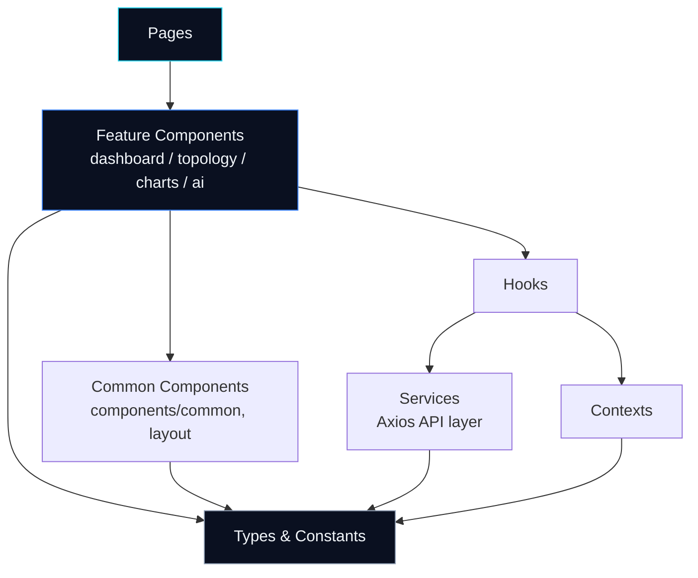

# Frontend Guidelines

> The engineering constitution for the HELIOS frontend. Every contribution to `frontend/` is expected to comply with this document. Where this document is silent, prefer the simplest solution consistent with the principles below and raise the gap in a PR description rather than inventing a convention silently.

## Table of Contents

1. [Purpose](#1-purpose)
2. [Scope](#2-scope)
3. [Frontend Philosophy](#3-frontend-philosophy)
4. [Core Principles](#4-core-principles)
5. [Clean Architecture in HELIOS](#5-clean-architecture-in-helios)
6. [Component-First Development](#6-component-first-development)
7. [Feature-First Organization](#7-feature-first-organization)
8. [Naming Conventions](#8-naming-conventions)
9. [Import Ordering](#9-import-ordering)
10. [React Best Practices](#10-react-best-practices)
11. [Hook Guidelines](#11-hook-guidelines)
12. [Context Usage](#12-context-usage)
13. [Props Design](#13-props-design)
14. [State Management Rules](#14-state-management-rules)
15. [Styling Rules & Tailwind Conventions](#15-styling-rules--tailwind-conventions)
16. [Responsive Development](#16-responsive-development)
17. [Accessibility Standards](#17-accessibility-standards)
18. [Error Handling](#18-error-handling)
19. [Loading States](#19-loading-states)
20. [Empty States](#20-empty-states)
21. [Performance Rules](#21-performance-rules)
22. [Code Review Expectations](#22-code-review-expectations)
23. [Documentation Standards](#23-documentation-standards)
24. [Git Workflow Expectations](#24-git-workflow-expectations)
25. [Things Developers Should Never Do](#25-things-developers-should-never-do)
26. [Related Documents](#26-related-documents)

---

## 1. Purpose

HELIOS is an AI-native autonomous network operating system. Its frontend is the operator-facing surface for a system that makes autonomous decisions about live network infrastructure — bandwidth allocation, slice creation, failover routing, emergency prioritization. Operators must be able to trust, at a glance, what the system is seeing, what it is about to do, and why.

This document exists so that every engineer who touches `frontend/` — regardless of who they are or when they joined — produces code that is architecturally consistent, predictable to review, and safe to extend. It is the single source of truth for *how* we write frontend code. It does not define *what* the UI looks like (see [DESIGN_SYSTEM.md](./DESIGN_SYSTEM.md)) or *where* code lives (see [APP_STRUCTURE.md](./APP_STRUCTURE.md)) — those are companion documents and are cross-referenced throughout.

## 2. Scope

This document governs everything inside `frontend/src/`. It applies to:

- All React components, hooks, and contexts
- All TypeScript types and utilities
- All styling (Tailwind usage, CSS custom properties)
- All data-fetching and service code
- All tests written against frontend code

It does **not** govern the backend, AI engine, or simulator — those are out of scope for this repository's frontend team. Where the frontend needs to describe backend interaction, it must do so exclusively through the contracts defined in [API_CONTRACTS.md](./API_CONTRACTS.md). Frontend code must never assume undocumented backend behavior.

## 3. Frontend Philosophy

HELIOS frontend is built around three commitments, in priority order:

| Priority | Commitment | Why it matters here |
|---|---|---|
| 1 | **Legibility under pressure** | This is an operations dashboard for network incidents. A confusing UI during a real event (tower failure, DDoS, congestion spike) has real consequences. Every screen must be understandable in seconds, not minutes. |
| 2 | **Predictable structure** | Multiple contributors (AI, Backend, Simulation, Frontend leads) touch this repo. Code should look like it was written by one disciplined engineer, not four different ones. |
| 3 | **Progressive polish** | Motion, glow, and glass effects (see [DESIGN_SYSTEM.md](./DESIGN_SYSTEM.md)) exist to communicate system state (health, alerts, activity) — not as decoration. Visual flourish is never allowed to compromise clarity or performance. |

We explicitly reject "hackathon-grade" engineering: components that mix five responsibilities, ad hoc prop-drilling six levels deep, inline magic numbers, and copy-pasted logic. HELIOS's frontend is a long-lived reference implementation, not a demo throwaway.

## 4. Core Principles

1. **Single Responsibility** — a component renders one coherent piece of UI; a hook encapsulates one concern; a service module talks to one API surface.
2. **Explicit over implicit** — no hidden side effects, no "magic" global mutation, no undocumented assumptions about load order.
3. **Composition over inheritance** — React has no class inheritance model to abuse, but the same instinct shows up as deeply nested prop-passing or god-components. Prefer small components composed together.
4. **Typed by default** — if the compiler can catch it, it must catch it. `any` is a defect, not a shortcut.
5. **Data flows down, events flow up** — see [Section 14](#14-state-management-rules).
6. **Fail loud in development, fail safe in production** — errors should be impossible to miss while building, and impossible to crash the whole app once shipped (see [Section 18](#18-error-handling)).
7. **Every screen has three states minimum** — loading, empty, and populated. Most also need an error state. See [Sections 18–20](#18-error-handling).

## 5. Clean Architecture in HELIOS

The frontend is organized in layers with a strict, one-directional dependency rule: **outer layers may depend on inner layers; inner layers must never depend on outer layers.** The full folder-level mapping of this diagram lives in [APP_STRUCTURE.md](./APP_STRUCTURE.md#dependency-direction); this section defines the *rule*, not the folders.



Concretely:

- A **page** may import feature components, hooks, and contexts.
- A **feature component** (e.g. something in `components/topology/`) may import common components, hooks, types, and constants — but must never import another unrelated feature's internals directly (e.g. `topology/` reaching into `charts/` internals). Shared logic between features is promoted to `hooks/`, `utils/`, or `components/common/`.
- A **common component** must be feature-agnostic. It cannot import from `components/dashboard`, `components/topology`, `components/charts`, or `components/ai`. If it needs to, it isn't common — move it.
- A **service** (Axios wrapper) must never import a React component or hook. Services are framework-agnostic data-access modules.
- A **hook** may call a service, but a **service** must never call a hook.
- **Types and constants** sit at the center and may be imported from anywhere, but must never import from components, hooks, contexts, or services.

Violating this graph (e.g. a service importing a hook, or a common component importing a feature component) is a blocking code review issue, not a style nitpick.

## 6. Component-First Development

Every unit of UI is a component before it is anything else. Concretely:

- If a piece of markup is reused more than once, or is conceptually a distinct "thing" (a card, a badge, a gauge), it becomes its own component — even if it's currently only used once. Anticipated reuse is a valid reason to extract; speculative *configurability* is not (see [Section 25](#25-things-developers-should-never-do)).
- Components are written as function components using arrow functions or `function` declarations with explicit `React.FC`-free typed props (prefer typing the props object directly over wrapping in `React.FC`, to keep `children` typing explicit and avoid implicit generic issues).
- A component file exports exactly one component as its primary export. Small, private, non-reusable sub-components used only to break up a large render function may be colocated in the same file above the main export.
- Presentation and data-fetching are separated: a component that needs remote data calls a hook (`useX`) that encapsulates the fetching/subscription logic; the component itself only renders based on the hook's return value. See [Section 11](#11-hook-guidelines).

## 7. Feature-First Organization

Beyond the top-level clean-architecture split, components are grouped by **feature domain**, not by technical type. This is why `src/components/` has `dashboard/`, `topology/`, `charts/`, `ai/`, and `layout/` subfolders instead of a flat list, and why `components/common/` exists as the explicit escape hatch for genuinely shared UI. Full rationale and folder-by-folder breakdown lives in [APP_STRUCTURE.md](./APP_STRUCTURE.md).

Rule of thumb: **ask "which part of the product does this belong to?" before asking "what kind of component is this?"** A `HealthGauge` belongs to `dashboard/` because it's a dashboard concern, not because "gauges" are a technical category.

## 8. Naming Conventions

### 8.1 File Naming

| File type | Convention | Example |
|---|---|---|
| Component | `PascalCase.tsx` | `NetworkTopology.tsx` |
| Hook | `camelCase.ts`, prefixed `use` | `useSimulationTick.ts` |
| Context | `PascalCase.tsx`, suffixed `Context` | `SimulationContext.tsx` |
| Service | `camelCase.ts`, suffixed by domain | `topologyService.ts` |
| Utility | `camelCase.ts` | `csvLoader.ts` |
| Type-only file | `camelCase.ts` (barrel: `index.ts`) | `types/index.ts` |
| Constants | `camelCase.ts` or `SCREAMING_SNAKE` export names | `constants/thresholds.ts` |
| Route definitions | `camelCase.ts` | `routes/routes.tsx` |

### 8.2 Folder Naming

All folders are `lowercase`, and pluralized when they hold multiple instances of a thing (`hooks/`, `services/`, `pages/`) and singular when they represent a single conceptual layer (`app/`, `styles/`). Existing project structure (see [APP_STRUCTURE.md](./APP_STRUCTURE.md)) is the canonical reference — do not introduce a new top-level folder without updating that document first.

### 8.3 Code-Level Naming

| Construct | Convention | Example |
|---|---|---|
| Component name | `PascalCase` | `HealthGauge` |
| Hook name | `camelCase`, `use` prefix | `useSimulation` |
| Variable / function | `camelCase` | `towerUtilization` |
| Type / Interface | `PascalCase` | `TowerUtilizationRow` |
| Enum-like unions | `PascalCase` type, `camelCase` values | `type EventSeverity = 'info' \| 'warning'` |
| Constants (true constants) | `SCREAMING_SNAKE_CASE` | `MAX_HISTORY`, `TOTAL_TICKS` |
| CSS custom properties | `--kebab-case` | `--accent-cyan` |
| Boolean variables/props | `is` / `has` / `should` prefix | `isLoading`, `hasError`, `shouldAnimate` |
| Event handler props | `on` prefix | `onNodeSelect` |
| Event handler implementations | `handle` prefix | `handleNodeSelect` |

Do not abbreviate domain terms (`tower`, `edge`, `latency`, `bandwidth`) — this codebase models real network concepts and abbreviations create ambiguity (e.g. `lat` could mean latency or latitude in a networking context).

## 9. Import Ordering

Imports are grouped into the following blocks, in order, separated by a single blank line. Within a block, imports are alphabetized by module path.

1. External packages (`react`, `react-router-dom`, `axios`, `recharts`, `cytoscape`, `framer-motion`, `react-icons/*`)
2. Internal absolute/aliased imports, if a path alias is configured (contexts, hooks, services, types, constants, utils)
3. Relative imports from sibling or parent directories (`../components/...`, `./ChildComponent`)
4. Style imports (`./Component.css`, global CSS)
5. Type-only imports use `import type { … }` and are placed within their appropriate block above, not in a separate block

```ts
// 1. External
import React, { useCallback, useState } from 'react';
import { useNavigate } from 'react-router-dom';

// 2. Internal (contexts / hooks / services / types)
import { useSimulation } from '../context/SimulationContext';
import type { SelectedNode } from '../types';

// 3. Relative
import NodeDetailPanel from './NodeDetailPanel';

// 4. Styles
import './NetworkTopology.css';
```

This ordering is enforced by lint configuration where possible; where the linter cannot enforce it, reviewers must.

## 10. React Best Practices

- **Function components only.** Class components are not used anywhere in this codebase and must not be introduced.
- **No default exports for anything except the primary component of a file.** Hooks, utilities, and types use named exports so that imports are searchable and refactor-safe.
- **Keys are stable and meaningful.** Never use array index as a `key` for lists that can reorder, filter, or animate (this matters especially for `topology/` and `charts/` components driven by ticking simulation data).
- **Derive, don't duplicate, state.** If a value can be computed from existing state or props during render, compute it during render — do not mirror it into a second `useState`.
- **Conditional rendering stays readable.** Prefer early returns over deeply nested ternaries. A component with more than two levels of nested conditional JSX should be split.
- **Refs are for imperative escape hatches only** (e.g. handing a DOM node to Cytoscape.js), never as a substitute for state that should drive a re-render.

## 11. Hook Guidelines

- Every hook name starts with `use`, with no exceptions, including hooks that only wrap a context (`useSimulation`, following the existing pattern in `context/SimulationContext.tsx`).
- A hook that reads a context must throw a clear, actionable error if called outside its provider (this is already the pattern in `useSimulation` — replicate it, don't reinvent it).
- Hooks that manage subscriptions, timers, or listeners must clean up in the `useEffect` return function. An uncancelled interval or listener is a bug, not a nitpick.
- Custom hooks belong in `src/hooks/` when shared across features, or colocated with a single feature's components when feature-specific. A hook used by only one component does not need to move to `hooks/` — extraction is triggered by reuse or by test-ability needs, not by convention alone.
- Hooks must not perform side effects during render. All side effects belong inside `useEffect`, an event handler, or a function returned for the caller to invoke.

## 12. Context Usage

Context in HELIOS is reserved for **cross-cutting application state** — state that genuinely needs to be read by many components at different depths (e.g. `SimulationContext`, which drives the entire dashboard's tick/playback state). Context is explicitly **not** a default state-management tool for every feature.

Before adding a new Context, confirm:

1. The state is needed by components that do not share a direct parent within a few levels.
2. Prop-drilling would meaningfully hurt readability (not just "requires passing one prop down two levels").
3. The state doesn't belong in local component state, in the URL (via `react-router-dom`), or in a service-owned cache instead.

Each Context follows the existing `SimulationContext.tsx` shape:

- A typed context value interface.
- A `Provider` component that owns state and effects.
- A `useX()` hook as the only sanctioned way to consume it (never `useContext(RawContext)` directly from a component).
- A thrown error when consumed outside its provider.

Contexts must not be nested more than is necessary; if two contexts always change together, consider merging them.

## 13. Props Design

- Props interfaces are named `<ComponentName>Props` and declared directly above the component, or imported from `types/` if shared across components.
- Prefer a small number of well-typed, purposeful props over a generic `config` object — a `config: any`-shaped prop defeats type safety and hides the real API of the component.
- Boolean props default to `false`-equivalent behavior when omitted; avoid props that require the *absence* of a value to mean something different from an explicit `false`.
- Callback props are typed with explicit argument and return types — never `Function` or untyped arrow types.
- Children are typed explicitly (`children: React.ReactNode`) when a component accepts them; do not accept children "just in case."
- A component should not need more than ~7 props before it's a signal to reconsider decomposition (either the component is doing too much, or a group of related props should be combined into a single typed object).

## 14. State Management Rules

HELIOS follows a strict unidirectional data flow: **data flows down through props, events flow up through callbacks.** There is no ambient global mutable state outside of React's own state primitives and Context.

State ownership hierarchy (most to least local):

1. **Local component state** (`useState`, `useReducer`) — default choice. Most UI state (open/closed, hover, form input) lives here.
2. **Feature-level Context** — for state shared across a whole feature (e.g. `SimulationContext` for tick/playback/filter state shared across every dashboard panel).
3. **URL state (via `react-router-dom`)** — for state that should survive a refresh or be shareable/bookmarkable (selected node, active route, active filter view). See [ROUTES.md](./ROUTES.md).
4. **Service-layer cache** — for server data fetched via the Axios service layer. Services own the fetching and caching concern; components and hooks consume it, they do not re-implement caching themselves.

Rules:

- Never duplicate server state into local component state "just to render it" — read it from the hook/service layer directly, or via a context if broadly shared.
- Never derive one piece of state from another with a `useEffect` + `setState` pair if the value can instead be computed inline during render. This is one of the most common React anti-patterns and is not permitted in this codebase.
- State updates that depend on the previous value must use the updater-function form of `setState` (`setX(prev => …)`), not a captured stale closure value.

## 15. Styling Rules & Tailwind Conventions

Full visual specification (colors, spacing scale, radii, shadows, motion curves) lives in [DESIGN_SYSTEM.md](./DESIGN_SYSTEM.md). This section governs *how* styling is authored, not what it looks like.

- **Tailwind utility classes are the default.** Reach for Tailwind first for layout, spacing, typography, and one-off styling.
- **Custom CSS is reserved for what Tailwind cannot express cleanly**: multi-step keyframe animations, `backdrop-filter` glass effects, pseudo-element glow accents, and reusable named effects (`.glass-card`, `.kpi-card`, etc., as already established in `src/index.css`). These live in global stylesheets under `src/styles/`, using the existing named-class pattern — not scattered inline `style={{ … }}` objects, except for truly dynamic, computed-at-runtime values (e.g. a gauge fill percentage).
- **Design tokens are CSS custom properties**, defined once on `:root` (see `src/index.css` and [DESIGN_SYSTEM.md § Color System](./DESIGN_SYSTEM.md#color-system)) and referenced via `var(--token-name)`. Do not hardcode hex values in component code or in new CSS — if a color isn't already a token, add the token first.
- **No inline magic numbers for spacing/sizing that already has a Tailwind scale equivalent.** Use Tailwind's spacing scale (`p-4`, `gap-6`, …) rather than arbitrary values (`p-[17px]`) unless matching a genuinely fixed design constraint (e.g. a chart's exact pixel height).
- **Tailwind v4 CSS-first configuration**: this project uses `@import "tailwindcss";` with no `tailwind.config.js`. Theme customization happens via CSS, not a JS config object — do not add a `tailwind.config.js` without a documented reason, since it would fight the existing v4 setup.
- Class name ordering within `className` strings should be layout → box model → typography → color/visual → state/responsive variants, for scanability. This is a convention, not a hard lint rule, but should be followed for consistency.

## 16. Responsive Development

HELIOS's primary surface is an operations dashboard intended for large monitor / desk use (NOC-style). Desktop is the primary target; the layout must still degrade gracefully rather than break outright on smaller viewports.

- Breakpoints follow Tailwind's default scale (see [DESIGN_SYSTEM.md § Breakpoints](./DESIGN_SYSTEM.md#breakpoints)) unless a documented product reason requires a custom one.
- Build mobile-first in Tailwind class order (unprefixed styles are the smallest-viewport baseline, then layer `md:`, `lg:`, `xl:` up) even though the primary target is desktop — this keeps behavior predictable and avoids relying on desktop-only assumptions leaking into the base styles.
- Grid-heavy dashboard layouts (see current `App.tsx` `gridTemplateColumns` pattern) should define explicit collapse behavior for narrower viewports rather than silently overflowing or clipping.
- Never assume a fixed pixel viewport. Percentage/flex/grid-based layouts are required for anything inside the main dashboard shell.

## 17. Accessibility Standards

Full accessibility specification lives in [ACCESSIBILITY.md](./ACCESSIBILITY.md). At the engineering-rule level:

- All interactive elements (`sim-btn`, `speed-btn`, `filter-toggle`, search inputs, etc.) must be real interactive elements (`<button>`, `<input>`) or carry the correct ARIA role — never a `<div onClick>` with no keyboard affordance.
- Color is never the sole carrier of meaning. Status indicators (`status-green`, `status-yellow`, `status-red`) must be paired with text, icon, or shape, since the dashboard's dark/glow palette is not guaranteed to be distinguishable for all users.
- Focus states must be visible and must not be suppressed (`outline: none` without a replacement focus style is not permitted).
- Motion-heavy UI (glow pulses, particle backgrounds, slide-in animations — see [ANIMATIONS.md](./ANIMATIONS.md)) must respect `prefers-reduced-motion`.

## 18. Error Handling

- Every service call (Axios request) must have an explicit error path — a failed request must never fail silently or leave a component in a stuck "loading forever" state.
- Component-level errors that would otherwise crash a large section of the UI (e.g. a malformed topology payload crashing Cytoscape rendering) must be caught by an error boundary scoped to that section, not allowed to crash the entire dashboard.
- User-facing error messages describe what happened and, where possible, what the user can do — never a raw stack trace or raw Axios error object rendered into the UI.
- Errors are logged with enough context to debug (which request, which component) but must never leak sensitive data into logs or the UI.

## 19. Loading States

- Every component that depends on asynchronous data (service call, context still initializing) must render an explicit loading state — never a blank screen or a layout jump once data arrives.
- Prefer skeleton/placeholder shapes that match the eventual content's layout over a single generic spinner, for anything above a small inline control. The existing full-app `loading-screen` / `loading-ring` pattern in `index.css` is the reference implementation for full-page loads; panel-level loads should use lighter-weight in-place placeholders.
- Loading states must not block interaction with unrelated parts of the UI — a slow chart should not freeze the topology view.

## 20. Empty States

- Any list, table, chart, or panel that can legitimately have zero data (no alerts, no events, no matching filter results) must have a designed empty state with a clear message — never an empty `<div>` or a broken/empty chart render.
- Empty states should distinguish between "genuinely nothing here" (e.g. no active alerts — good news) and "nothing matches your filter" (actionable — tell the user how to reset).

## 21. Performance Rules

- Expensive derived computations (aggregating history arrays, transforming CSV-loaded datasets) are memoized (`useMemo`) when they run on every render with unchanged inputs — this matters especially given the simulation's per-tick update cadence.
- Callbacks passed to memoized children are stabilized with `useCallback` where the child is genuinely performance-sensitive (e.g. Cytoscape event handlers, chart interaction handlers) — do not reflexively wrap every function in `useCallback` where there is no measured or structural benefit.
- Large lists (event logs, node lists) must be windowed/virtualized once they can grow unbounded; the existing `MAX_HISTORY` cap pattern in `SimulationContext` is the right instinct — bounded history over unbounded accumulation.
- Route-level code splitting is required once `react-router-dom` routes are introduced — see [APP_STRUCTURE.md § Lazy Loading Strategy](./APP_STRUCTURE.md#lazy-loading-strategy).
- Animations use GPU-friendly properties (`transform`, `opacity`) as established in the existing keyframes (`slide-in-right`, `slide-up`, `fade-in`) — avoid animating layout-triggering properties (`width`, `height`, `top`, `left`) in loops.

## 22. Code Review Expectations

A PR is reviewable when it:

- Touches one coherent concern (one feature, one bug fix, one refactor) — not a bundle of unrelated changes.
- Includes or updates tests for new logic (see [Section 23](#23-documentation-standards) and the project's general testing rules in `AGENTS.md`).
- Does not introduce a new pattern that duplicates an existing one without explanation (e.g. a second way of doing data fetching alongside the established service pattern).
- Passes lint (`oxlint`) and type-checking (`tsc -b`) cleanly.

Reviewers are expected to check against this document specifically — architecture-layer violations (Section 5), naming violations (Section 8), and state-management anti-patterns (Section 14) are blocking, not optional nitpicks.

## 23. Documentation Standards

- Code should be self-documenting through naming (Section 8) first; comments are reserved for *why*, not *what* — a comment explaining a non-obvious workaround or invariant is welcome, a comment restating the line below it is not.
- Any new architectural decision, new top-level folder, or new cross-cutting pattern must be reflected in the relevant `docs/frontend/*.md` file in the same PR that introduces it — documentation drift is treated as a bug.
- Public hooks and services that are consumed outside their own file should have a short doc comment describing their contract (inputs, outputs, side effects), not a full essay.

## 24. Git Workflow Expectations

Branch naming and commit format follow the repository-wide rules defined in `AGENTS.md` (`feature/`, `bugfix/`, `hotfix/`, `docs/` branch prefixes; `feat:`, `fix:`, `refactor:`, `docs:`, `test:`, `chore:` commit prefixes). Frontend-specific additions:

- Frontend-only changes should not be bundled into the same commit as backend/AI-engine/simulator changes, even in a monorepo — keep history bisectable per subsystem.
- A PR that changes visual behavior should note it clearly in the description; a PR that changes the folder structure or a cross-cutting pattern must reference the relevant section of this document or [APP_STRUCTURE.md](./APP_STRUCTURE.md).

## 25. Things Developers Should Never Do

- **Never** introduce `any` to silence a type error — fix the type, or narrow it explicitly with a documented reason if a true escape hatch is unavoidable.
- **Never** reach across feature boundaries (e.g. `components/topology` importing directly from inside `components/charts`) — see [Section 5](#5-clean-architecture-in-helios).
- **Never** hardcode a color, spacing value, or radius that already exists as a design token — see [Section 15](#15-styling-rules--tailwind-conventions) and [DESIGN_SYSTEM.md](./DESIGN_SYSTEM.md).
- **Never** invent a backend API endpoint, request/response shape, database table, or environment variable. If it isn't defined in [API_CONTRACTS.md](./API_CONTRACTS.md) or `AGENTS.md`, it does not exist yet — leave a `TODO` and flag it rather than guessing. This mirrors the repository-wide rule in the root `CLAUDE.md`.
- **Never** mutate props or context state directly — always go through the provided setter/dispatch/controls.
- **Never** ship a component with no loading, empty, or error handling for data it depends on, when that data can plausibly be absent, empty, or slow.
- **Never** suppress lint or type errors with blanket disables (`// eslint-disable` covering a whole file, `@ts-ignore` without a linked explanation) instead of fixing the underlying issue.
- **Never** add a new state-management library, CSS framework, animation library, charting library, or any dependency outside the finalized stack (React, Vite, Tailwind CSS, React Router, Axios, Recharts, Cytoscape.js, Framer Motion, React Icons) without an explicit decision to change the stack — the stack is finalized, not a menu.
- **Never** commit generated build output, `node_modules`, or local `.env` files.

## 26. Related Documents

| Document | Covers |
|---|---|
| [DESIGN_SYSTEM.md](./DESIGN_SYSTEM.md) | Visual language: color, type, spacing, motion, component visual specs |
| [APP_STRUCTURE.md](./APP_STRUCTURE.md) | Folder-by-folder application architecture and data flow |
| [COMPONENT_LIBRARY.md](./COMPONENT_LIBRARY.md) | Inventory and API of reusable components |
| [ROUTES.md](./ROUTES.md) | Route map and navigation structure |
| [API_CONTRACTS.md](./API_CONTRACTS.md) | Frontend↔backend contract definitions |
| [DASHBOARD_LAYOUT.md](./DASHBOARD_LAYOUT.md) | Dashboard grid and panel composition |
| [VISUALIZATION_GUIDE.md](./VISUALIZATION_GUIDE.md) | Topology and chart visualization conventions |
| [ANIMATIONS.md](./ANIMATIONS.md) | Motion and animation specification |
| [ACCESSIBILITY.md](./ACCESSIBILITY.md) | Accessibility requirements and testing |
